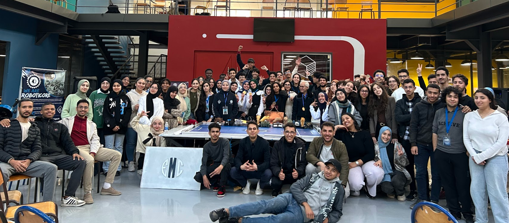
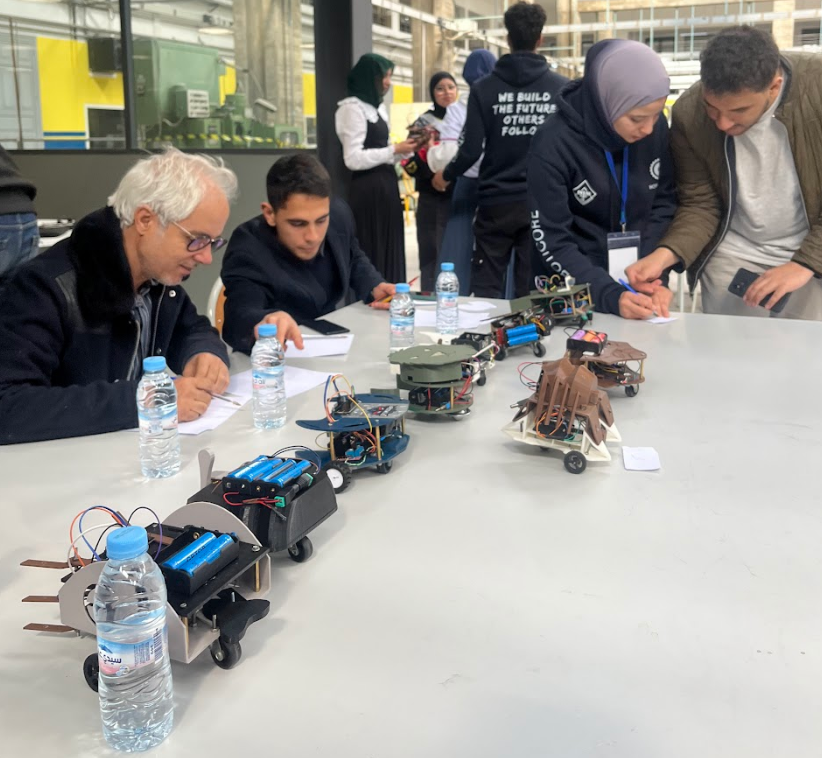

# EMC-Robot

## Description

<video src="media/o1.mp4" controls autoplay muted loop></video>

EMC-Robot is a soccer robot created for the 2025 ENSAM Makers' Competition.

I served as a **judge** for this exact same competition, and this robot was built as a showcase to demonstrate to the participants what was possible — a reference design illustrating the level of craft, engineering, and polish achievable within the scope of the contest.

The robot was designed in Catia, 3D printed on a Bambulab printer, and rendered using Keyshot. It runs on an ESP32 programmed in C, providing Bluetooth connectivity for control from a mobile device.

## Project Structure

The project is organized as follows:

- `/src` — source code for the robot's functionality
- `/CAD Files` — all CAD files

## Videos

**Goaaaal!**

<video src="media/o2.mp4" controls autoplay muted loop></video>

**Celebration haha**

<video src="media/o3.mp4" controls autoplay muted loop></video>
